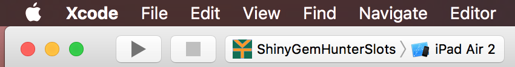
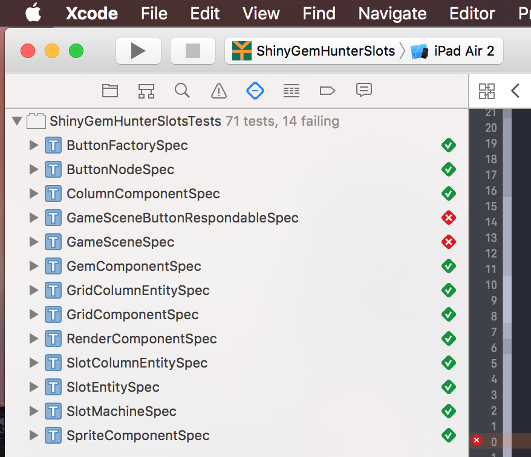
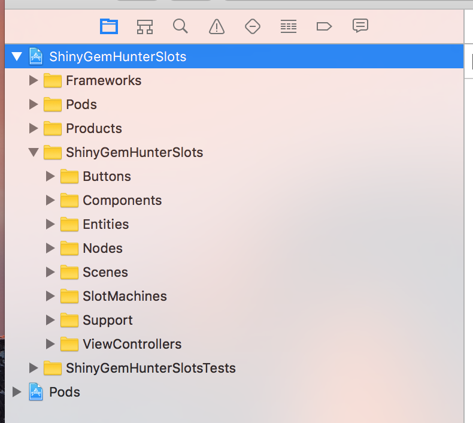
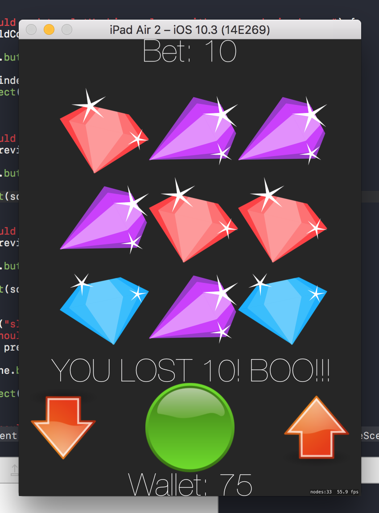

## master branch build status:


[Travis CI build monitor](https://travis-ci.org/vantanllc/ShinyGemHunterSlots)

## Pillar PluggedIn Event
Help! The master branch CI build is red! Someone merged in code without running all the tests! We need your help. Let's get started!

## First, we need to pull down the code!
```
git clone https://github.com/vantanllc/ShinyGemHunterSlots.git {YOUR DESIRED PATH HERE}
```

We then need to create a new branch!
```
git checkout -b {NAME YOUR BRANCH HERE}
```

## Opening the xcworkspace
We are using Swift 3 and targeting iOS 10. Make sure you have Xcode 8 or above. Get the update from the App Store if you need to upgrade.

Run Xcode 8 and open up the ```ShinyGemHunterSlots.xcworkspace``` file. This xcworkspace file will pull in our ShinyGemHunterSlots.xcodeproj and the cocoapods we depend on.
Once you open up the workspace, make sure you update the device simulator to an iPad device.



## Show me them shortcuts
Press ```Command u``` to run all the tests!

Press ```Command 5``` to get to the Test Navigator view. You will be presented the failing tests.



Press ```Command 0``` to get to the Project Navigator view. You can traverse through the project files.



Press ```Command r``` to run the app! 

## Remember to commit often
Make sure you commit as your tackling these failing tests to save your progress!
We will use a test account to commit and push your branch.
```
git config user.name "{YOUR NAME}"
git config user.email "shinygemhunterslots@gmail.com"
```

Woohoo! We can now commit some sweet code!
```
git add -p
git commit -m "I wrote code!!!"
```

Once you have all the tests passing. Commit! And push your branch!
```
git push https://shinygemhunterslots@github.com/vantanllc/ShinyGemHunterSlots.git HEAD
```
git will ask for a password to complete the push. Refer to the presenter for the password.

## Travis CI is your friend
Now go to Travis CI to watch your branch run tests and build the application!

[Travis CI build monitor](https://travis-ci.org/vantanllc/ShinyGemHunterSlots)


## Time to go cash them gems outside! How about that!

